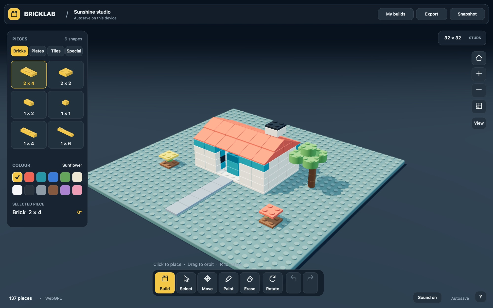

# Bricklab

A free 3D brick workshop that runs in your browser. Snap pieces onto a 32 × 32 stud plate, stack and paint them, and pick up where you left off. No framework, external fonts, CDN dependency or build step. Three.js 0.186.1 is vendored with its MIT license.

- **Studio:** https://swiftugandan.github.io/bricklab/studio/
- **Website:** https://swiftugandan.github.io/bricklab/



## Run locally

```sh
git clone https://github.com/swiftugandan/bricklab.git
cd bricklab
python3 -m http.server 4173 --directory dist
```

Open `http://localhost:4173`. To force the WebGL 2 fallback, open `http://localhost:4173/?renderer=webgl`.

Run the domain tests with Node 20 or later:

```sh
npm test
```

## Repository layout

- `dist/` is the studio itself. It's served as-is; there is nothing to compile.
- `site/` is the marketing page served at the root of the GitHub Pages site.
- `tests/` holds the Node test suite for the domain model.
- `.github/workflows/` runs the tests on every push and pull request, and deploys `site/` to `/` and `dist/` to `/studio/` on GitHub Pages from `main`.

## Architecture

- `dist/src/model.js`: integer stud/plate domain model, validated transactions, undo/redo, versioned project serialization, part catalog and starter builds.
- `dist/src/scene.js`: WebGPU renderer with Three.js automatic WebGL 2 fallback, geometry caches, instanced part batches, lighting, camera, raycasting and placement feedback.
- `dist/src/hud.js`: canvas-native responsive tools, piece catalog, colour palette, project panels and keyboard focus treatment.
- `dist/src/main.js`: pointer/touch and keyboard input, domain commands, device-local autosave, import/export, image export, sound and optional WebMCP tools.

The only visible elements are the 3D canvas and the canvas UI. Native file selection is used for importing projects. Models autosave on the device; there is no account-based or cross-device storage.

## Implemented scope

19 parametric pieces in four categories; 12 colours; stud-grid placement and stacking; collision and build-volume bounds; rotate, select, move, paint, duplicate, erase and height adjustment; 80-level undo/redo; three starter scenes; project import/export; PNG snapshots; local autosave; orbit, pan, zoom and top/front views; touch and keyboard controls.

Rendering is invalidated on demand, pixel ratio is capped at 1.75, and geometry is shared and instanced by part type. The model is capped at 2,000 pieces.

## Known limitations

- **No gravity yet.** Bricklab is a creative builder, not a structural connection simulator. Pieces can be placed in mid-air with the height offset, and bricks stay suspended when their supports are removed.
- **WebGL 2 fallback.** On one macOS machine, every three.js WebGL render (including a single cube) logged ANGLE "Metal error: Compiler encountered an internal error" and the studio's first WebGL frame did not finish within 60 seconds. WebGPU rendered the same scene in about 0.5 seconds. It hasn't been tested on other machines yet; reports are welcome.

## Verification status — 5 October 2026

PASS: Seven domain tests covering collision/stacking, rotated bounds, history, atomic invalid-import rejection, starter round-trips and capacity.

PASS (Chrome, macOS, WebGPU): the starter scene renders with no runtime errors, a click places a brick and autosaves it, and drag-orbit works.

NOT YET VERIFIED: the full checklist below, mobile touch interaction, frame timings with large scenes, and the WebGL fallback on hardware other than the machine described above.

## Browser acceptance checks

1. Open a normal URL and verify the starter scene, readable trays, responsive layout and absence of runtime errors.
2. Place a brick, stack another, rotate at the plate boundary and confirm occupied space is rejected.
3. Select, paint, duplicate, move, raise/lower and delete; verify undo/redo for each.
4. Export a project, replace the build, reimport and compare the model. Check malformed/oversized files are rejected without losing current work.
5. Reload and verify autosave recovery. Download a PNG and inspect the image.
6. Use mouse orbit/pan/zoom and a mobile touchscreen with tap, drag and pinch. Check 390×844, 768×1024 and 1440×900 viewports.
7. Repeat core placement and snapshot checks with `?renderer=webgl`; verify `bricklabDiagnostics()` reports the actual backend.
8. Exercise a 2,000-piece scene, record frame timings while orbiting, and verify idle render counts stop increasing.
9. Validate optional WebMCP valid and invalid inputs when the browser exposes `document.modelContext`.

## Contributing

Issues and pull requests are welcome. Keep the studio dependency-free and build-free, run `npm test` before opening a pull request, and add a test to `tests/model.test.js` for any change to the domain model.

## License

[MIT](LICENSE). Three.js is included under its own MIT license in `dist/vendor/THREE-LICENSE.txt`.

Bricklab is an independent fan project and isn't affiliated with any toy brick maker.
